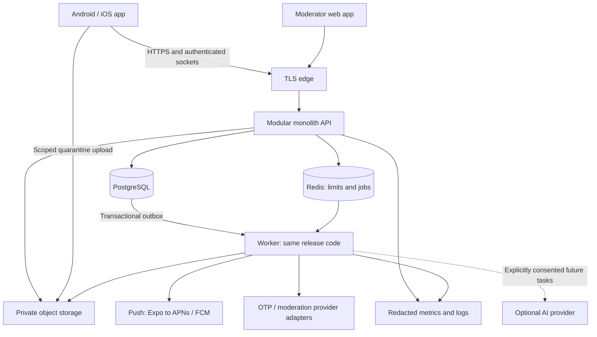

# System architecture and technology decisions

Status: proposed; no services implemented. See [mobile](mobile.md), [database](database.md), [security](security.md) and [Docker](docker.md) for detailed contracts.

## Stack recommendation

Use a TypeScript monorepo with React Native + Expo development builds, a NestJS modular monolith, PostgreSQL, Redis for rate limits/jobs, private S3-compatible object storage, and a small React/Vite moderator app. Backend API and worker use the same codebase and release image with separate process commands. No consumer web app is required for P0; public policy/support/deletion pages are.

React Native wins here because the P0 is mostly profile, photo feed, forms, navigation and chat; shared TypeScript contracts and tooling reduce the review surface for the stated small team. This is an engineering judgment, not proof that it is universally faster or that Nepal has more available React Native developers. Confirm hiring availability and the senior reviewer's ability to review native integrations.

| Criterion | React Native + Expo | Flutter | Decision consequence |
| --- | --- | --- | --- |
| Performance | Native integration with JS/UI work requiring profiling | Compiled Dart and own rendering pipeline | Either can serve P0; benchmark real feed/chat on low-end hardware |
| UI quality | Platform controls/conventions plus shared components | Highly consistent custom UI, Material/Cupertino support | Both require accessibility and platform-specific polish |
| Device APIs/camera/media | Expo modules plus custom native modules through development builds | Platform plugins/channels | Audit chosen libraries, permissions and native build compatibility |
| Video playback | Native media integrations; lifecycle and list recycling need care | Native player integrations with similar lifecycle concerns | P0 has no video; later spike playback/compression on both OSes |
| Push/location/auth/chat | Mature integration approaches, not automatic parity | Mature plugin/networking approaches, not automatic parity | Server rules and real-device validation matter more than framework |
| Shared backend/admin tooling | TypeScript types and schema generation | Generated API client, separate Dart ecosystem | Lower coordination cost favors RN for this team model |
| App-store deployment | Expo hosted builds/signing or native projects | Native Android/iOS build pipelines | Both need store accounts and native signing |
| Long-term maintenance | Expo/RN upgrade compatibility and occasional Swift/Kotlin work | Flutter/plugin upgrades and occasional Swift/Kotlin work | Allocate native maintenance regardless of choice |
| Docker integration | Backend independent; JS tooling can run in devcontainer | Backend independent; Dart tooling can run in container | Neither makes iOS a Linux-container build |
| Developer availability | Plausible shared TS hiring pool; unverified locally | Dedicated Dart/Flutter hiring; unverified locally | Test actual candidates, not popularity claims |

Other options: separate Kotlin/Swift apps offer direct native control but double much of this small team's feature work. Kotlin Multiplatform can share logic while retaining native UI, but adds build/review complexity here. Capacitor/WebView would not meet the intended first-class mobile UX without substantial extra work. Flutter should replace the recommendation if the native spike or actual reviewer capability favors it.

Technical rationale references: [React Native performance](https://reactnative.dev/docs/performance), [Flutter architecture](https://docs.flutter.dev/resources/architectural-overview), and [Expo build environments](https://docs.expo.dev/build/introduction/). This comparison was not benchmarked.

| Layer | Proposed choice | Reason and alternative considered |
| --- | --- | --- |
| Workspace | pnpm workspaces; TypeScript strict mode | One lockfile, simple packages; no task-orchestration platform until needed |
| Mobile | Expo Router, TanStack Query, small local state | Routes, server-state cache and predictable retry; avoid a global store for everything |
| API | NestJS with REST/OpenAPI | Explicit module boundaries and validation; Django is strong for admin but introduces a second primary language; Go adds little P0 value |
| Persistence | PostgreSQL, Prisma plus reviewed SQL migrations where necessary | Relational integrity for users/pairs/chat and readable review workflow; no document DB for core relationships |
| Jobs/cache | Redis + BullMQ | Bounded retries/rate limits and worker ecosystem; PostgreSQL remains source of truth |
| Real time | Socket.IO in the API process | Reconnect/room support; durable messages still use HTTP/DB contracts |
| Media | Private S3-compatible API; provider chosen after latency/privacy review | Upload offload, lifecycle and restricted delivery; no app-host disk storage in production |
| Admin | React/Vite with server-enforced role permissions | Small case queue and audit interface; no separate business backend |
| Search | PostgreSQL indexes and explicit filters | No Elasticsearch or vector DB for P0; people are not searchable by contact information |
| Analytics | Minimal first-party events, aggregate SQL, redacted crash reporting | Avoid invasive SDKs and recording intimate screens |
| AI | Disabled in P0; provider adapter later | No inference dependency in core loop; compare against simple heuristics |

Pick and lock compatible supported package/runtime versions in the foundation milestone after a clean native build. Do not mix arbitrary “latest” versions. License and maintenance review must include the S3 development server, native libraries and moderation providers.

## Logical system

Modules: identity/sessions; profiles/preferences; content/media; discovery; connections/matching; messaging; safety/moderation; notifications; operational analytics. Future modules: communities/events, billing, AI assistance. Each owns its tables and service operations; another module calls an interface rather than silently writing those tables. One database and transactions are deliberate advantages of the monolith.

Proposed tree (not created in this phase): `apps/mobile`, `apps/api`, `apps/admin`, `packages/contracts`, `packages/config`, `infra`, `.devcontainer`, `docs`. Worker code lives with API modules, not a second implementation of business rules.

## API and state contracts

REST `/v1`, opaque UUID identifiers, bounded cursor pages and stable machine-readable errors. All inputs validated and fields allowlisted. Server-generated response DTOs must never serialize raw ORM rows. The client carries no database credentials or privileged provider secrets.

| Endpoint family | Critical contract |
| --- | --- |
| `POST /auth/challenges`, `/auth/verify`, `/auth/refresh` | Generic errors, throttling and rotating sessions; verify challenges atomically |
| `GET/PATCH /me/profile`, `/me/preferences` | Field-level validation; birth date/contact data never in public DTOs |
| `POST /media/uploads`, `/media/{id}/complete` | Owner-scoped quarantine upload; completion is not approval |
| `GET /discovery`, `/feed`, `/profiles/{id}` | Reapply eligibility, block and visibility rules every request; cap pagination and enumeration |
| `POST /posts`, `DELETE /posts/{id}` | Owner-only; draft/pending/approved/rejected/removed states |
| `POST /connection-requests` | Idempotency key; eligible target; one active pair request; optional approved post reference |
| `POST /connection-requests/{id}/accept` | Recipient-only transaction; lock canonical pair, check blocks/suspensions and create one match |
| `POST /connection-requests/{id}/decline` and `/withdraw` | Actor-specific transition; no public rejection reason |
| `GET /matches`, `/matches/{id}/messages` | Active membership and visibility check on reads |
| `POST /matches/{id}/messages` | Unique client message ID; match/pair lock for block race; commit before acknowledgment |
| `POST /matches/{id}/unmatch` | Atomically close pair contact; reporting still available through restricted historical context |
| `POST /blocks`, `DELETE /blocks/{targetId}`, `POST /reports` | Block immediately; unblock never restores old match automatically |
| `PUT /me/devices`, `/me/notification-preferences` | Rotate/revoke push endpoints; generic notification content by default |
| `POST /me/export`, `DELETE /me` | Step-up confirmation, session revocation, queued export/deletion lifecycle |
| `/admin/cases`, `/admin/actions`, `/admin/appeals` | Separate admin identity, MFA, scoped access and immutable audit |

Use `401` for invalid sessions; `404` for inaccessible private resources where existence must not leak; `409` for visible state conflicts; `429` with retry information for throttling. Do not reveal whether another person blocked the caller.

Socket events carry small event IDs and resource IDs: `match.created`, `message.available`, `match.closed`. Authenticate connection and every room join; disconnect revoked sessions and removed members. No bearer tokens in URL query logs. Clients reconcile with authorized REST reads after reconnect; sockets/push are hints, not the source of truth. Presence, typing indicators and read receipts are deferred.

## Correctness and asynchronous work

Request acceptance, block, unmatch and message-send operations acquire the same canonical pair lock and use a consistent locking order. Duplicate accepts produce one match. Two simultaneous opposing requests do not automatically count as consent to match: present an explicit acceptance action. Retried sends produce one durable message. A message accepted just before a block can already have been seen; subsequent fetch/delivery is denied. Do not promise to retract screenshots or content already delivered.

Write business state and an outbox event in one database transaction. Worker dispatch is at least once, with unique event/consumer keys, bounded retries, dead-letter states and observable failures. Recheck membership, blocks, account status and notification preferences when executing jobs. Push providers can duplicate or delay notifications; include no sensitive payload and reconcile in-app.

The media pipeline is upload → quarantine → type/size/decode validation → EXIF removal and derivatives → moderation → approved visibility. Reject malformed files, decompression bombs and mismatched MIME. Failed scans leave media hidden; orphan uploads expire. Client compression saves bandwidth, but server validation is authoritative.

## Discovery without premature AI

First filter: adult/account eligibility, reciprocal age/gender preferences, explicit intentions compatibility, chosen areas, discovery enabled, active/recent state, no block and no existing closed pair cooldown. Treat sensitive preferences as private. Then order using explicit shared interests, freshness and exposure diversity. Record factual reasons and experiment version. No inferred ethnicity/caste/sexual orientation, attractiveness, income or migration desirability.

Small curated pages are enough. Log exposure aggregates to detect a few profiles absorbing all attention; cap repeated exposure rather than selling visibility. Feed and profile discovery share candidate eligibility and authorization. When someone changes their privacy settings, invalidate caches and recheck at response time.

## Availability and scaling

Registered-user counts do not determine load. Track DAU, requests per active user, concurrent sockets, media bytes, database latency, queue lag and moderator capacity. An illustrative scenario of 1 million registered users, 10% DAU and 100 dynamic requests per DAU yields 10 million requests/day, about 116 average RPS before peaks. A tenfold peak would be about 1,160 RPS. These are synthetic sizing inputs, not a capacity claim; measure traffic shape before buying infrastructure.

| Stage | Architecture evolution driven by evidence |
| --- | --- |
| 1,000 users | One API and worker deployment, managed DB/storage where feasible, measured queries, backups and manual moderation |
| 10,000 | Add API replicas when latency/CPU demands; pooled DB connections; shared socket adapter only with multiple API replicas; tune indexes |
| 100,000 | Optimize discovery queries and worker concurrency; evaluate read replicas, message partitioning, authorized media edge caching and specialized search only from measured bottlenecks |
| 1,000,000 | Load-test peak concurrency; possibly isolate chat/media workloads, partition hot data and expand regions after privacy/consistency design; no promise monolith needs immediate replacement |

Initial engineering targets: server read p95 under 300 ms excluding mobile network/upload time, text-message acceptance p95 under 500 ms, and 99.5% pilot API availability. These are proposed budgets to measure. Define error budget, latency by region and queue-age alerts before release. Benchmark Nepal and Australia from real networks before selecting a hosting region.

Use managed PostgreSQL with encrypted backups and point-in-time recovery when available. Proposed production objectives: RPO <=15 minutes and RTO <=4 hours, subject to tested restore and budget. Redis loss must not lose committed messages or outbox work. Provider outage means retryable OTP/push and hidden unmoderated uploads, not bypassed safeguards. Deployment uses reviewed migrations, expand/contract schema changes, backward-compatible mobile API support, staging, controlled rollout and rollback drills.

## AI boundary

If later justified, an asynchronous assistance adapter receives only explicitly permitted data for the task, with a versioned prompt, spend cap, timeout and non-AI fallback. Do not grant it tools to send messages, change matches or access raw private conversation history. Evaluate hallucination, language quality, stereotyping and user acceptance. User text/media are untrusted content, never operational instructions. Model decisions cannot silently ban accounts or determine who is “worthy” of introduction.
