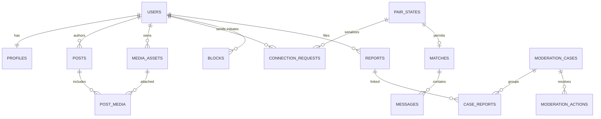

> Historical discovery proposal (28 September 2026). The later user-authorized beta is implemented; see [current scope](beta.md), [README](../README.md), and [verification](verification.md). Proposed services and future features below are not claims of delivered functionality.

# Logical database design

Status: proposed schema, not migrations. PostgreSQL is the authoritative store. UUID primary keys, UTC `timestamptz`, explicit foreign keys and controlled status values throughout. IDs are opaque, not authorization. Store dates of birth as private dates, not public timestamps. Use database integrity constraints plus application transactions; do not trust client checks.

## P0 entities

| Entity | Main fields and relationships | Important constraints/access |
| --- | --- | --- |
| users | id, status, created_at, deleted_at, last_active_at | active/suspended/deletion_pending/deleted; never expose raw row |
| auth_identities | user_id, provider, encrypted_contact, keyed_lookup_hash, verified_at | unique provider + keyed normalized-contact hash; separate from public profile |
| auth_challenges | identity_lookup, code_hash, attempts, expires_at, consumed_at | short-lived; bounded attempts; atomic consume; not plaintext OTP |
| sessions | user_id, refresh_token_hash, family_id, expires_at, revoked_at | token rotation/reuse detection; sessions revocable across devices |
| user_private | user_id, encrypted_birth_date, country_of_residence | restricted identity access; derived age only in public projection |
| profiles | user_id, display_name, bio, intent, city_id, visibility, discovery_enabled, readiness | one per user; field projection varies by viewer; pause removes discovery |
| dating_preferences | user_id, min_age, max_age, local_only, long_distance_opt_in | min >=18, max >= min; private; no sensitive preference exposure |
| preference_genders / preference_cities | user_id, selected value/id | unique membership; normalized explicit choices; not inferred identity |
| profile_identity_fields | user_id, self-described identity, per-field visibility | optional self-description; discovery use explicit and separate from public display |
| cities / discovery_areas | country_code, city_name, metro_area_id, timezone, launch_state | eight target cities; Valley metro groups Kathmandu/Bhaktapur/Lalitpur; no coordinates needed |
| interests / user_interests | interest_id, label/localizations; user_id | controlled taxonomy plus unique (user, interest) |
| profile_prompts | id, user_id, prompt_key, answer, position, moderation_state | limited count and length; revision triggers moderation if needed |
| media_assets | id, owner_id, quarantine_key, status, mime, size, dimensions, checksum | private object keys; uploaded/processing/approved/rejected/deleting; no public bucket URLs |
| media_variants | asset_id, variant_kind, private_key, size | unique (asset, kind); approved derivative access only |
| profile_media | user_id, media_id, position | ownership enforced; only approved assets displayed |
| posts | id, author_id, body, audience, status, created_at, deleted_at | audience eligible_discovery or matches; draft/pending/approved/rejected/removed |
| post_media | post_id, media_id, position | ownership and allowed type; bounded attachments |
| pair_states | user_low_id, user_high_id, contact_state, version | PK canonical ordered pair; low < high; locking anchor for requests/matches/blocks/messages |
| connection_requests | id, pair ids, sender_id, recipient_id, post_id?, note, status, expires_at | sender != recipient; at most one pending request per canonical pair; source post nullable after deletion |
| matches | id, pair ids, accepted_request_id, status, created_at, ended_at | unique canonical pair for P0; one match lifecycle per pair; user actions cannot resurrect ended match |
| messages | id, match_id, sender_id, client_message_id, sequence_no, encrypted_body, created_at | unique (match, sender, client_message_id) and (match, sequence_no); text only P0 |
| conversation_settings | match_id, user_id, muted_until | member-only; unique pair of keys; no read receipts in P0 |
| blocks | blocker_id, blocked_id, created_at | unique directed pair, no self-block; either direction denies contact |
| reports | id, reporter_id, subject_user_id, target reference, category, status, created_at | one valid target type; reporter privacy; report does not equal confirmed violation |
| report_evidence | report_id, evidence_reference, encrypted_snapshot, expires_at | minimum necessary, restricted access and immutable provenance; independent of content deletion |
| moderation_cases | id, severity, status, assigned_admin_id, next_action_due | new/triaged/in_review/actioned/closed; reopen/appeal supported |
| case_reports / moderation_actions | case_id, report_id; actor, action, reason, affected_subject, expiry | action records append-only; sanctions separate from report counts |
| appeals | id, user_id, action_id, state, reviewer_id | role separation where feasible; decision history preserved |
| verifications | user_id, kind, provider_reference, state, checked_at, expires_at | phone/photo/liveness/age are distinct; minimal result, no indefinite raw biometric storage |
| device_endpoints | user_id, installation_id, encrypted_push_token, platform, revoked_at | unique active endpoint; reassignment revokes old association |
| notification_preferences | user_id, type, enabled, quiet_hours, timezone | policy defaults explicit; no implicit marketing opt-in |
| notifications / delivery_attempts | user_id, type, resource_id, state; provider result | unique event-recipient-channel key; generic payload; current permission check on delivery |
| consent_records | user_id, purpose, policy_version, granted/withdrawn_at | versioned history; essential terms separated from optional marketing/AI consent |
| account_jobs | user_id, type export/delete, state, due_at, completed_at | auditable multi-store completion; revocation begins before async cleanup |
| admin_accounts / roles / audit_events | admin identity, scoped role; action metadata | MFA; append-only audit; no unrestricted consumer impersonation |
| outbox_events / job_receipts | event_id, aggregate_id, type, payload_ref, state; consumer id | business transaction writes outbox; idempotent consumption; keep payload minimal |
| idempotency_records | actor_id, route, key, request_hash, result_ref, expires_at | same key/different request rejected; no sensitive raw body copies |
| analytics_events | event_id, pseudonymous_actor, event_type, version, timestamp, minimal properties | deduplicate; no message body, raw identity or precise location |

Do not implement every row as an elaborate generic framework. For example, a small controlled role enum may be enough; the table expresses the required concept, not a demand for a configurable permission platform.

## Relationships

Sender/recipient membership, media ownership and audience checks need explicit service/transaction enforcement where cross-table SQL CHECK constraints cannot express them. Use foreign keys, unique constraints and carefully reviewed triggers only where justified. Do not assume an ORM automatically guarantees pair-level correctness. [PostgreSQL constraint documentation](https://www.postgresql.org/docs/current/ddl-constraints.html) informs the integrity approach.

## Critical transitions

Request: pending → accepted, declined, withdrawn, expired or invalidated. Only recipient accepts/declines; only sender withdraws. Proposed expiration is 14 days with no urgency marketing. Closed requests are historical; reject repeated harassment with server cooldown/rate policy. Reciprocity does not automatically accept.

Accept transaction: obtain/create pair row; lock it; reread users, block directions, current request and eligibility; atomically mark accepted, insert unique match and write outbox event. Concurrent attempts return the existing result only when authorized. A block or suspension prevents acceptance regardless of stale client UI.

Send transaction: lock pair in the same order; confirm active match and membership; recheck account and block states; allocate sequence number; persist one message under unique client ID; append outbox. Acknowledge after commit. Cursor history uses sequence number rather than offset. Never rely on wall-clock timestamps for total message order.

Block transaction: lock pair; insert directed block; invalidate pending request, end active match and write revocation events. Unblock removes only the block; it does not restore messages or matches. P0 rematching with an ended pair is disallowed; later rematching requires an explicit new consent model and schema revision.

Pause: hide profile/posts from discovery, stop new incoming requests, keep existing chat if selected. Deletion: revoke sessions/endpoints and hide account immediately, then run verified cleanup of personal data/media/caches and derived events. Report evidence may be retained under a narrowly defined policy rather than blindly cascade-deleted.

## Indexes and query strategy

- Discovery starts with eligible profile status + area + recent activity, then joins explicit reciprocal preferences and anti-joins blocks/closed pairs. Review `EXPLAIN ANALYZE` on realistic distributions; arbitrary demographic indexes are not a substitute for measured plans.
- Posts: partial index on approved, nondeleted posts by `(created_at DESC, id DESC)` plus author/status access; stable cursor includes both fields. Safety filters always run after any candidate cache.
- Blocks: unique `(blocker_id, blocked_id)` and reverse lookup index.
- Requests: recipient/status/created_at, sender/status, and a partial unique canonical-pair index where pending.
- Matches: unique pair plus participant/status access; messages: unique `(match_id, sequence_no)` and client-id dedupe.
- Cases: status/severity/next_action_due; outbox: undelivered/available_at; cleanup jobs: state/due_at.

Avoid creating P2 tables before their feature contracts are validated. Do not shard the initial database; move large immutable messages/events toward partitioning only when growth metrics justify it. Connection pooling, bounded queries and indexes come first.

## Deferred entities required by the broader concept

| Entity group | Logical design when introduced | Why deferred |
| --- | --- | --- |
| Comments | post_id, author_id, parent_id?, body, moderation_state | Public comments are excluded from MVP; requires new audience/block rules |
| Reactions | actor_id, post_id, type; unique actor/post/type | Validate whether private appreciation helps or adds ambiguity |
| Followers | follower_id, followed_id, request/accepted state; unique pair | General following is currently rejected; design only if product evidence changes |
| Communities | community, membership/role, rules, bans, moderator assignments | Requires hosting and moderation independent of dating eligibility |
| Events | organizer, city, venue reference, capacity, event time/timezone, RSVP, cancellation | Attendance private; booking/refund and safety obligations first |
| Subscriptions | user, store, original transaction reference, product, status, expiry | Store webhook verification, refund/revocation and replay protection needed |
| Store transactions / entitlements | immutable provider event; validated user entitlement projection | No client-owned paid state; no billing service in P0 |
| Date proposals / feedback | match_id, coarse venue suggestion, mutually accepted time, private feedback | No live location; measure consent and utility before building |
| AI assistance requests | user, consent version, task, minimal data reference, result expiry, usage cost | No raw-chat training corpus; keep opt-in and deletable |

See [security](security.md) for retention. Schema fixtures must be synthetic; never clone production intimate data into developer environments.
