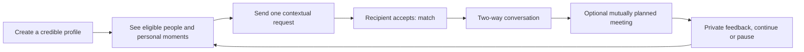

> Historical discovery proposal (28 September 2026). The later user-authorized beta is implemented; see [current scope](beta.md), [README](../README.md), and [verification](verification.md). Proposed services and future features below are not claims of delivered functionality.

# Product strategy and MVP

Status: proposed plan, 28 September 2026. Confirmed: native-quality Android/iOS; eight target cities; small team with Codex-assisted development, senior developer review and DevOps deployment. Unvalidated: demand, pricing, demographics, conversion targets and the superiority of a social feed. Evidence and limits are in [research](research.md).

## A. Product thesis and critique

Help relationship-seeking Nepali adults meet someone whose everyday personality and intentions make starting a conversation easier. The promise is **enough context to connect, enough control to feel comfortable**.

The original idea combines three cold starts: a dating marketplace needs mutually eligible people, a social feed needs contributors, and communities need hosts. AI adds neither people nor trust. Building all three at once would spread a small team across media infrastructure, moderation and weakly connected experiences.

The primary customer is a person seeking a relationship, not a creator seeking followers. Social content is evidence of personality inside that journey. Dating and social profiles should therefore be one account with explicit visibility controls, not two identities users must maintain. Do not launch a general-purpose friendship or creator mode alongside dating.

People may already have photos and stories elsewhere, but scraping or importing their social graph introduces consent, platform and privacy problems. Ask for two prompts and an optional everyday photo instead. If this lighter context does not help, remove the separate feed and keep prompts on profiles.

## B. Geography, density and first 1,000 users

Target Kathmandu, Bhaktapur, Lalitpur, Pokhara, Sydney, Melbourne, Perth and Brisbane. Treat the three Valley cities as a connected metro market while preserving broad-area preferences. Pokhara and each Australian city are distinct local markets. The app can represent all cities from P0; a city can be waitlisted instead of showing an empty feed.

Recommended sequence: launch a Valley closed pilot; research and recruit waiting cohorts in all other target cities; open Pokhara and one Australian city when reciprocal supply is sufficient; then open the remaining Australian cities. Select the first Australian city from actual opt-ins and eligible candidate counts, not assumed population rankings. Never silently fill a thin local feed with people on another continent.

Offer local-only as the default. An explicit cross-border preference can include named cities and willingness to explore long distance; no immigration or relocation promises. City visibility and dating visibility must be clear before discovery is enabled. Use IANA time zones; Sydney/Melbourne, Brisbane, Perth and Nepal cannot share one fixed UTC offset.

Acquisition plan, with hypothetical milestones rather than forecasts:

1. Interview about 30 potential users across Nepal and Australia, including privacy-sensitive and underserved groups. Map needs and recruitment channels.
2. Recruit 50–100 consenting founding users through trusted Nepali clubs, adult professional groups, alumni networks and personal opt-in referrals. Ambassadors facilitate onboarding; they do not see private preferences, conversations or candidate identities.
3. Grow to 250 reviewed profiles in the first metro cohort. Measure mutually eligible supply and response rates weekly; recruit into undersupplied opt-in segments without advertising that exposes sensitive group membership.
4. Grow toward 1,000 activated accounts across opened cohorts. Record source, onboarding completion, qualified conversations, cost and safety burden per channel. Do not count an email waitlist as 1,000 active daters.

A proposed city-opening gate is that at least 80% of ready profiles have 15 mutually eligible, recently active candidates, with no critical safety backlog. These are starting thresholds to calibrate, not research-backed industry norms. Check subgroup distributions privately; do not exclude an underserved group simply to inflate the average. Offer a truthful waitlist and targeted recruitment if the gate fails.

Use private referral codes and generic landing pages; no contact-book upload, public attendee directory or invitation revealing the inviter's dating profile. A flat ambassador honorarium may be tested; rewards tied to dates or messages would create bad incentives.

## C. Magic moment and product loop

**Magic moment:** “They noticed something real about me, and I want to answer.” A match counter is a weaker outcome than an accepted, specific introduction.

Example: someone posts a photo from a pottery class with a short reflection. A mutually eligible person sees it, checks their intentions and profile, and sends one contextual request. The recipient accepts and their conversation opens with that shared context. Neither person needs a public audience.

First-session value is seeing relevant, genuine candidates and knowing how to approach one. Do not promise an immediate reply. If supply is unavailable, show that honestly rather than simulated activity.

Tomorrow's reason to return is a reply or a relevant small batch of introductions. Next week's is a continuing connection and an optional new personal moment. Next month's may be a relationship, a pause, or a new considered introduction. Successful exit is a positive outcome. No streaks, artificial expiry pressure, or engagement penalties for not posting.

## D. Feature decisions

Every row states a problem, intended outcome, cost/risk and a cheap way to validate it. MUST HAVE maps to P0; SHOULD HAVE to P1; FUTURE to P2; EXPERIMENT is not a launch commitment.

| Feature | Class | Why, complexity and validation |
| --- | --- | --- |
| Registration, age gate, sessions and recovery | MUST HAVE | Establish account control and adult eligibility; abuse and recovery are complex. Test delivery and recovery on both OSes. |
| One profile, relationship intentions, interests, language and reciprocal preferences | MUST HAVE | Clarify fit without duplicate identities. Test comprehension; optional identity disclosure must be controlled. |
| Broad city selection and local/cross-border choice | MUST HAVE | Relevant supply across the requested cities without GPS exposure. Test users understand which cities can see them. |
| Two prompts, profile photos, optional text/photo moments | MUST HAVE | Minimum personality context. Compare connection outcomes with profile-only prototype. |
| Small eligible-person feed, profile discovery and transparent reasons | MUST HAVE | Combine social/dating discovery instead of building two ranking engines. A factual reason such as a shared interest is sufficient. |
| Contextual connection request, accept/decline/withdraw | MUST HAVE | Combine post reply, profile like and dating intent into one private action. This replaces public comments and generic like collecting. |
| Mutual matching, text chat, unmatch | MUST HAVE | Complete the core loop; requires concurrency, privacy and retry tests. No unsolicited inbox. |
| Match/message push, inbox and controls | MUST HAVE | Help conversations continue without spam. Measure delivery separately from engagement. |
| Report, block, mute, moderation and appeals | MUST HAVE | Safety operation, not a decorative button. Run case drills before admitting users. |
| Privacy, deletion, pause, generic lock-screen notifications | MUST HAVE | Support control and successful exits. Test deletion across storage, queues and backups. |
| Contact verification and risk review | MUST HAVE | Reduce disposable accounts. Label phone verification accurately; it is not identity or age verification. |
| Selfie/liveness verification | SHOULD HAVE | Potential authenticity improvement with biometric/vendor and exclusion risks. Evaluate provider, retention and appeal rates before broad public launch; escalate risk cases in beta. |
| Private reaction without a connection request | SHOULD HAVE | Lower effort appreciation may help shy users but could create another ambiguous inbox. Test before adding. |
| Ready-to-meet mutual signal and simple date planning | SHOULD HAVE | Reduce chat limbo. Manual prototype first; never expose precise location automatically. |
| Improved referrals and opt-in weekly prompt | SHOULD HAVE | Reduce acquisition/content effort. Start manually; no posting streaks or public referral leaderboard. |
| Accessibility refinement and additional localization | SHOULD HAVE | Core accessibility and Nepali text support remain P0. Expand translated guidance after native-speaker review. |
| User-selectable quiet introduction mode | EXPERIMENT | Profile visible only to people the user approaches may help privacy, but shrinks supply. Test opt-in impact on both sides. |
| Private “was this comfortable?” feedback | EXPERIMENT | Measures outcome without scanning chat semantics. Never display private ratings or turn them into a public trust score. |
| Conversation-cap suggestions | EXPERIMENT | Could reduce overload, but hard limits can coerce replies. Start with optional pause/reminder controls. |
| Interest circles and hosted small gatherings | EXPERIMENT | May establish trust and bring supply together. Run a consented, manually organized event before building groups. |
| Voice intro, optional short video intro | EXPERIMENT | Could convey personality, but raises bandwidth, accessibility and moderation costs. Validate after text/photo loop works. |
| AI profile editing and suggested questions | EXPERIMENT | Optional help for user's own words; user approves every edit/send. Measure quality against fixed prompts; evaluate privacy and cost. |
| Compatibility learning and AI matchmaker | FUTURE | Requires enough reliable outcomes and bias evaluation. Rules based on explicit preferences are P0. No pseudo-scientific compatibility percentage. |
| Communities, event booking, venue partnerships | FUTURE | Separate hosting, disputes and operations; only build after manual demand is demonstrated. |
| Subscription and verified store entitlements | FUTURE | Monetize real additional value after retention; creates billing/refund/support work. |
| General-purpose following, public like counts and popularity ranking | DON'T BUILD | Rewards audience building over reciprocal connection and increases exposure. Not needed to test the thesis. |
| Public comment threads | DON'T BUILD for MVP | Public harassment/moderation surface without a necessary dating benefit; use private contextual requests. |
| Reels, stories, livestreams and a creator economy | DON'T BUILD for MVP | Compete for entertainment time and require heavy media/moderation infrastructure. |
| Dating games, anonymous random chat and blind chat rooms | DON'T BUILD for MVP | Distract from intentional introductions and create identity/safety issues. Consider only a narrowly validated future concept. |
| Precise nearby maps, live location, background tracking | DON'T BUILD | Disproportionate stalking exposure. Broad area is sufficient. |
| Caste filters, attractiveness scores, “hot-or-not”, public trust scores | DON'T BUILD | Harmful incentives and sensitive profiling do not serve this product's thesis. |
| Paid access to safety, messaging after a mutual match, or privacy basics | DON'T BUILD | Undermines trust and the core test. |
| Fake profiles, automated romantic messages and AI partners | DON'T BUILD | Deceptive supply destroys the purpose and trust. |

## E. Actual MVP

P0 is an invite-controlled Android/iOS experience: age-gated account, recovery, profile, interests/intentions, broad city and explicit discovery scope, two prompts, photo/text posting, small personalized feed, contextual request, mutual match, reliable text chat, controlled notifications, pause/delete, safety controls, moderator console and minimal outcome telemetry.

This deliberately reinterprets the mobile prompt's “likes/comments” as a private contextual connection action. Public comments, video uploads and independent following are deferred on both platforms. Android/iOS parity applies to every released feature; deferred features must not exist as half-working platform-specific implementations.

P1: better onboarding, optional private reactions if validated, verification improvements, mutual meeting prompt, operational referral improvements and measured city expansion. P2: communities/events, store billing and AI improvements only after evidence. Experimental ideas above need a defined comparison and safety guardrail before production rollout.

## F. Defensibility and network effects

The strongest prospective moat is dense, trusted participation within local Nepali networks, combined with competent moderation and a reputation for useful introductions. Each relevant participant increases the potential reciprocal candidate pool. Better observed outcomes may improve recommendation quality with consent, but more data is not automatically better and deletion rights take precedence.

Cultural fluency, native-language support and trusted organizers can improve distribution. None is uncopyable. The diaspora becomes a secondary network advantage only when people explicitly want those connections. Features, a generic LLM, and a social feed are weak defenses. Do not expose a friendship or “trust graph” that reveals private relationships.

## G. Free versus paid

Keep registration, meaningful discovery, contextual requests within fair anti-spam limits, mutual chat, reporting, blocking, essential verification, pause and privacy free. Do not sell the removal of safety limits.

Later test a modest subscription for convenience such as saved discovery preferences and profile organization, or optional user-controlled profile coaching. Avoid claiming willingness to pay before interviews and real behavior. No boosts at launch: visibility auctions can worsen inequality before supply is healthy. Events may support ticket margin, and clearly labeled venue partnerships may support bookings; do not sell identities, preferences or conversation data.

Model contribution, not just gross revenue:

`monthly contribution = net collected revenue - payment/store costs - refunds - hosting/media - OTP - verification - moderation/support - AI usage`

`fully loaded CAC = acquisition spend + ambassador cost + allocated acquisition labor, divided by newly activated users`

Illustration only: 1,000 monthly active users at 3% paying and NPR 500 monthly would produce NPR 15,000 gross before any costs. Those invented inputs show why subscriptions alone may not sustain safety operations at small scale; they are not a pricing recommendation. Obtain provider quotes and separate NPR/AUD experiments before estimating runway.

## H. Success metrics

Use **weekly meaningful connection participation** as the North Star proxy: unique eligible active people who participate in at least one qualifying two-way conversation, divided by unique eligible weekly active people. Also show the numerator and denominator; a rate can improve merely by losing users. Eligible means adult, profile ready, not suspended/deleted; active means an intentional authenticated foreground action, not a push delivery.

A proposed qualifying conversation has at least two accepted human-sent text messages from each participant within seven days after match. This is an operational proxy, not proof of attraction, safety or a relationship. Suppress confirmed abusive/spam pairs from the quality-adjusted view, display the raw view too, and never assume no report means safe. Use optional private feedback and dates as separate outcome evidence; do not analyze intimate message contents for analytics.

| Metric | Operational definition |
| --- | --- |
| Activation | Registration cohort share completing a visible profile and sending or accepting a contextual request within 24 hours; show onboarding and supply failures separately |
| D1/D7/D30 retention | Registration cohort returning for an intentional action on local calendar day 1, 7 or 30; fix timezone at registration for cohort arithmetic |
| Match rate | Distinct accepted requests / distinct valid requests sent, with seven-day maturity window and city/cohort breakdown |
| Match to conversation | Matches with at least one message from each person in seven days / mature matches |
| Continuation | Matches reaching the qualifying conversation threshold / matches with a two-way conversation, same seven-day window |
| Date conversion | Optional mutually confirmed meetings within 30 days / matched pairs offered the feedback prompt; report response coverage and one-sided reports separately |
| Content creation | Eligible weekly active people publishing at least one approved moment / eligible weekly active people |
| Meaningful interactions | Contextual requests leading to a qualifying conversation / mature contextual requests; distinguish profile vs post origin |
| Safety | Reports and confirmed violations per 1,000 conversations; severity, recurrence, appeal reversals and time to first action; rising reports may mean better reporting access |
| Liquidity | Distribution of reciprocal eligible active candidates per profile, zero-result rate, request-response latency and concentration of exposure |
| CAC and revenue/user | Fully loaded CAC per activated user; net recognized monthly revenue / MAU, by country and acquisition channel |
| Successful exit | Voluntary relationship-related pause/deletion, separately from dissatisfied churn; never inferred from inactivity |

Instrument server events for profile-ready, approved-post, request-sent, accepted-match, message-accepted (metadata only), report/action, pause and deletion. Use idempotent event IDs, versioned definitions, UTC timestamps and minimal pseudonymous IDs. Exclude staff/test accounts, bots and duplicate deliveries. Aggregate small cohorts with minimum-count suppression; detailed sensitive segmentation requires explicit governance.

For the first mature pilot cohorts, consider activation >=50%, match-to-two-way-conversation >=40%, and D7 >=25% as tentative investigation thresholds. Do not present these as benchmarks. Evaluate denominators, confidence intervals, qualitative feedback, liquidity and safety together; if fewer than about 100 mature participants, treat percentages as directional. Compare profile-only versus context-assisted discovery before expanding the feed. Do not optimize time spent.

## I. User journeys

| Journey | Experience and important exit/failure state |
| --- | --- |
| New user | Neutral age screen → verify contact → accept policies → choose intentions/preferences/city → photos/prompts → visibility preview → genuine discovery or honest waitlist. Permission denial must not dead-end onboarding. |
| Dating | Relevant moment/profile → one contextual request → accept to match → two-way chat → optional meeting discussion. Decline is private; unmatch ends contact without requiring explanation. |
| Social | Create optional photo/text moment → choose audience → moderation → eligible people can request a connection. No follower obligation or public popularity score. |
| Community, later | Explicitly join an interest circle → see moderated activities → RSVP privately → choose whether to connect. Attendance never automatically creates a match or exposes dating status. |
| Safety incident | Report with optional immediate block → receipt and case state → triage → proportionate action → status update and appeal path. Reporter identity and moderator notes stay private. |
| Successful relationship | Pause discovery → keep existing chat if desired → optional private outcome feedback → export/delete or resume later. No guilt prompts. |
| Thin city | Register with clear waitlist state → optional generic referral → receive an opt-in opening notification. No phantom matches or silent geographic expansion. |

## J. What would change this plan

If people prefer polished profiles to ongoing posting, shrink moments to profile prompts. If trust concerns dominate, invest in verification and operations before feed growth. If one Australian city achieves better liquidity than the Valley, reorder rollout. If the team cannot staff safety or achieve useful reciprocal supply, keep the pilot closed. The plan should adapt to outcomes, not defend its feature list.
