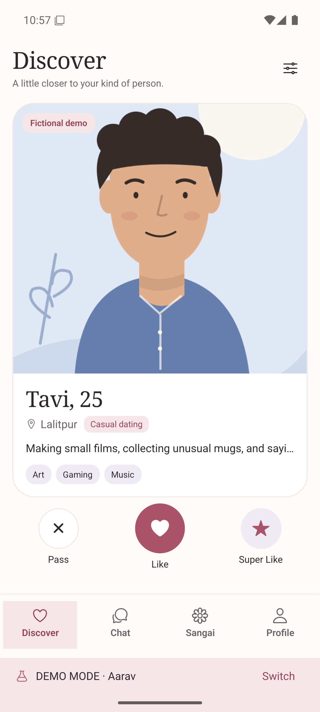
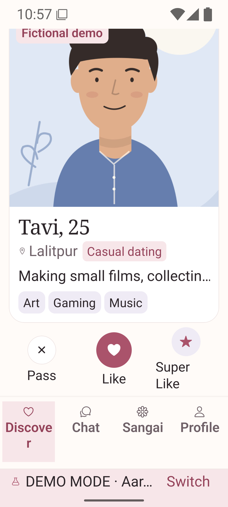

# UI reform: verification and local review

Work is isolated on `feat/ui-reform`, based on `530f3f8`. Application source: `75db48f`. The original palette and light-only behavior remain intact. The original `feat/cross-platform-web-beta` checkout and pending work are preserved. No EC2 access, deployment, merge or backend configuration change was made.

## Changes

Editorial headings, shared tokens, warm cards and stronger control outlines establish a consistent visual language. Discover prioritizes the person and their intent; a matched profile offers conversation before its longer gallery. Forms, invitations, reveals, posting, settings and safety tools share clearer hierarchy and recovery. Named dialogs, focus restoration, busy/selected semantics and enlarged navigation labels improve accessibility. Existing optimistic actions and rollback behavior remain intact.

The full browser icon font is 58.3% smaller, and initial HTML paint is branded. Route splitting was evaluated and removed because Expo's production lazy-route fallback briefly rendered an empty screen. Shipped navigation remains synchronous.

See the [design system](ui-reform-design-system.md), [initial audit](ui-reform-discovery.md), [before/after review](ui-reform-visual-review.md) and [measured performance](ui-reform-performance.md).

## Executed checks

| Check                                   | Result                                                          |
| --------------------------------------- | --------------------------------------------------------------- |
| API and mobile TypeScript               | Passed                                                          |
| Expo lint                               | Passed, no errors or warnings                                   |
| Credential/session tests                | 10/10 passed                                                    |
| Unchanged API/PostgreSQL suite in Linux | 83/83 passed                                                    |
| Full Chromium browser suite             | 98 passed; 3 opt-in screenshot tests skipped; 4.9 minutes       |
| Dedicated accessibility suite           | 14/14 passed on final export; included in the 98                |
| Reduced-motion regression               | 5/5 additional repetitions passed                               |
| Production Expo export                  | Web, Android and iOS JavaScript exports passed                  |
| Enabled visual audit                    | 131 scenarios at three sizes: 393 before and 393 after captures |
| Android x86_64 release                  | Passed: initial 15m 57s; final incremental build 3m 37s         |

The browser suite uses the unchanged API, a separate PostgreSQL database and local Mailpit inbox. Real local flows cover signup, email verification/reset, account switching, matching, messaging, game invitation/acceptance, private photo/video upload, cookie recovery and retained drafts. Mailpit does not prove provider delivery. The screenshot fixture proves synthetic presentation states separately.

Accessibility checks cover 360, 390, 768, 1024, 1440 and 1920 px; 44 px controls; actual 200% text/line-height scaling; long copy; modal keyboard focus/trapping/Escape/restoration; reduced motion; input hints/errors; selection semantics; and landscape. These are browser checks, not a full assistive-technology audit.

Initial failures exposed stale fixed-margin, hidden-route and hard-coded preview-host assumptions. Updated tests use configured origins, visible route content and relative carousel alignment. Another old assertion expected no Stories in Sangai; the unchanged base already shares MatchStrip between Sangai and Chat. The test now waits for and verifies that existing feature. No feature was removed to pass a test. The reduced-motion check still rejects real motion, allowing only the browser's finite 0.01 ms first-frame modal lifecycle animation before requiring zero animations.

The Windows API run passed 82/83 and hit an existing expiry timing assertion. Docker's database clock measured about eight seconds ahead of the Windows process. The unchanged suite passed all 83 with API tests and PostgreSQL inside Linux. No application or test timeout was changed to conceal the discrepancy.

## Measured performance

Under the same isolated synthetic Discover benchmark, median Lighthouse performance improved from **53 to 68 on mobile** and **90 to 92 on desktop**. Accessibility, best practices and SEO reached **100** on both profiles. Mobile first contentful paint improved from 2.857 to 0.756 seconds; largest contentful paint remained 9.796 seconds under simulated throttling. The 90+ mobile performance target was not met. See the performance report for all runs, settings, asset sizes and limitations; these are not EC2 or native startup measurements.

## Android artifact

Task artifact: `outputs/Sangai-ui-reform-75db48f-x86_64.apk`. This is an emulator build with bundled JavaScript and the existing development signing certificate, not an ARM phone/store release. APK v2 verification and `adb install -r` passed without clearing data.

- Size: 46,855,060 bytes.
- SHA-256: `d361bd9edd256bdfee27a16a86da92d5c0429da14562905c05d7a6a94850af5e`.
- All 112 source/asset/config/package inputs matched the isolated native build by SHA-256.
- Local API default: `http://10.0.2.2:4100`; Connection settings remain available.
- Device: SangaiBeta Pixel 7 emulator, Android API 36, x86_64.

The native review exercised the welcome/demo selector, all four destinations, an existing conversation, the game picker, profile editing and preview, own-account entry and return to a demo. Connection settings explicitly showed the local API. Saved-session restoration was verified after force-stop and relaunch, without Metro. The executed app-process AndroidRuntime/ReactNativeJS error check returned zero entries.

At Android font scale 2.0, the review found Discover's existing card gesture prevented vertical scrolling when content overflowed. A measured-layout gesture fix now yields vertical movement to the page while preserving horizontal decisions, taps, explicit Super Like and upward Super Like when the card fits. A repeated native check confirmed the same candidate remained during scrolling and all three action controls were visible and larger than 44 dp. System font scale was restored to 1.0. Four browser touch tests, included in the 98, verify overflow scrolling without a decision, horizontal Pass/Like, profile entry and upward Super Like when the card fits. The explicit post-scroll button payload is checked with an ordinary browser click. During discovery of the original native gesture issue, an upward swipe may have sent a Super Like in the local synthetic demo; no real account was used.

| Android Discover                                            | Android at 200% text, after scrolling                                                  |
| ----------------------------------------------------------- | -------------------------------------------------------------------------------------- |
|  |  |

Early hardware-renderer screenshots were stuck on an old frame despite current UI Automator data; those are diagnostic only. The emulator was restarted with software rendering and no saved snapshot load, preserving app data. The browser before/after images are independent of that issue. On the final emulator reboot, Android displayed a System UI not responding dialog; choosing Wait cleared it, after which Chat and Discover navigation responded. The emulator is left on Discover at normal text size. This host/emulator observation is retained in the local diagnostic captures, separate from application error checks.

## Reproduce isolated browser checks

With Node 24 and Docker Desktop, from the repository root:

```powershell
npm ci
npm run setup
node node_modules/@playwright/test/cli.js install chromium
docker compose -f tests/compose.ui.yaml up --build -d --wait
npm run web:build
$env:SANGAI_PREVIEW_PORT = '8083'
$env:SANGAI_PREVIEW_API = 'http://127.0.0.1:4510'
npm run web:preview
```

Keep the preview running. In a second terminal:

```powershell
$env:SANGAI_WEB_TEST_URL = 'http://127.0.0.1:8083'
$env:SANGAI_TEST_API_URL = 'http://127.0.0.1:4510'
$env:SANGAI_TEST_MAIL_URL = 'http://127.0.0.1:8425'
npm run test:ui
npm run check
npm run lint --prefix apps/mobile
npm run test:session
```

The test Compose file uses disposable fixture credentials and loopback ports, with mail directed to Mailpit. It does not read the deployment environment or reuse existing beta database/media volumes. Stop these fixtures with `docker compose -f tests/compose.ui.yaml down` when finished. The visual review has separate commands for the opt-in screenshot audit.

## Remaining verification

Native iOS cannot run here because Windows has no `xcrun`; an iOS JavaScript export does not prove native execution. Physical ARM Android/iPhone, Safari/Firefox, VoiceOver/TalkBack, real Google login, SMTP inbox delivery, push, hardware camera/microphone permissions, background media and the full native offline/permission matrix remain unverified in this UI task. The API-owned moderator console was inventoried but unchanged under the backend restriction. Synthetic Lighthouse measurements do not establish EC2 latency or production capacity. Review this branch locally before deployment. Five optional future ideas are in the visual review.
