# Sangai UI reform: visual review

The redesign keeps Sangai’s rose, blush, peach, lavender and warm white palette. Editorial headings give the app a clearer voice; readable control borders, warm cards and consistent spacing make the next action easier to find. The central journey remains a mutual match followed by a private conversation. Games, stories and moments support that conversation.

## Evidence and limits

The screenshot audit captured **131 route and state scenarios at each of three sizes**: 360 × 800, 768 × 1024 and 1440 × 1000. There are **393 before images and 393 after images**. Each image is one viewport; content below the fold is not automatically included. The audit covers normal, empty, loading, error, confirmation, form and modal states, including all seven Games 2.0 games and their reveals. It does not claim every possible data combination or device behavior.

All users, profile photos, messages and activity in these screenshots are explicitly synthetic. Browser requests to `/v1` were intercepted; external providers were blocked. The final manifests report no unexpected API requests, no browser runtime errors and no document-level horizontal overflow in these captures. That does not establish backend authorization, data persistence, real email delivery, Google sign-in, native camera permissions, video codec support, physical-device parity or screen-reader behavior.

The baseline was captured from the original frontend export before redesign work. A preserved copy lives locally at `outputs/sangai-ui-reform/before-export` in the workspace output directory. Normal private detail routes were captured after the existing app bootstrap and UI navigation. Earlier diagnostic failures remain separately recorded; they are not proof of a production authentication defect.

Two fixture corrections were made during review: visible selectors avoid hidden prior-screen labels, and the synthetic snap response now uses the API’s actual `viewUntil` field. All three original and redesigned snap-viewer images were recaptured. Captures wait for actual route content instead of treating a persistent tab label as a loaded screen. Application authentication and private-media expiry behavior were not altered to make screenshots pass.

The complete local comparison gallery is `artifacts/ui-reform/index.html`; detailed manifests are `artifacts/ui-reform/{before,after}/{360,768,1440}/coverage.json`. These generated artifacts remain local. The six curated pairs below are tracked in the repository for review.

## Six representative comparisons

### 1. Welcome · mobile

The opening screen now communicates connection before presenting account choices. A small brand illustration and editorial type establish the visual language; email remains the primary available sign-up action. Unconfigured Google sign-in stays visibly unavailable.

| Before                                                              | After                                                                |
| ------------------------------------------------------------------- | -------------------------------------------------------------------- |
| 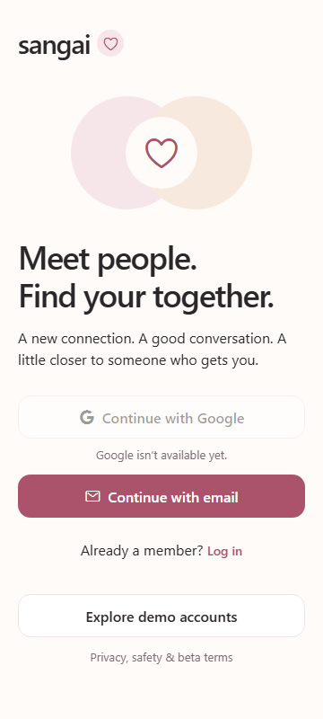 | 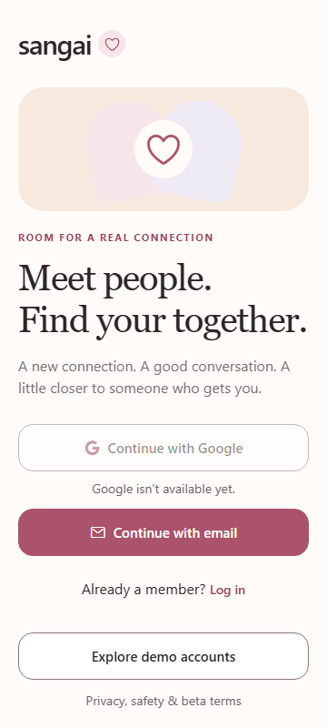 |

### 2. Discovery · mobile

The profile has a stronger name and intention hierarchy, a short contextual introduction and clearly separated choices. Demo labeling remains explicit. Like, Pass and Super Like retain their existing behavior.

| Before                                                                 | After                                                                   |
| ---------------------------------------------------------------------- | ----------------------------------------------------------------------- |
| 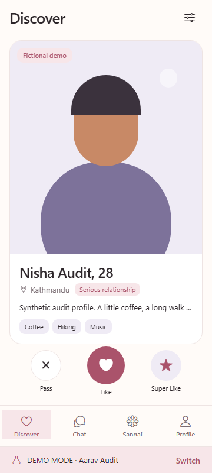 | 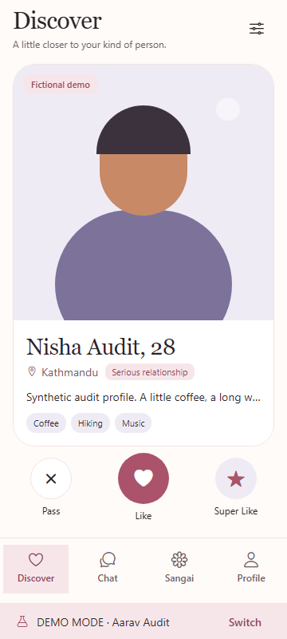 |

### 3. A matched profile · mobile

The conversation action appears directly after the profile’s identity, before the longer story and gallery. The same profile content remains available while the next step is easier to reach.

| Before                                                                             | After                                                                                                        |
| ---------------------------------------------------------------------------------- | ------------------------------------------------------------------------------------------------------------ |
| 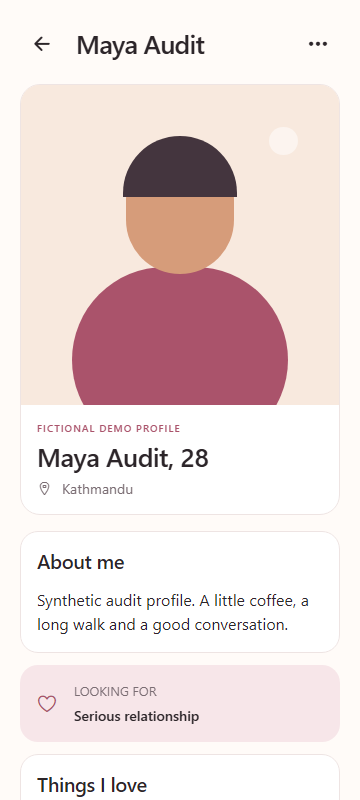 | 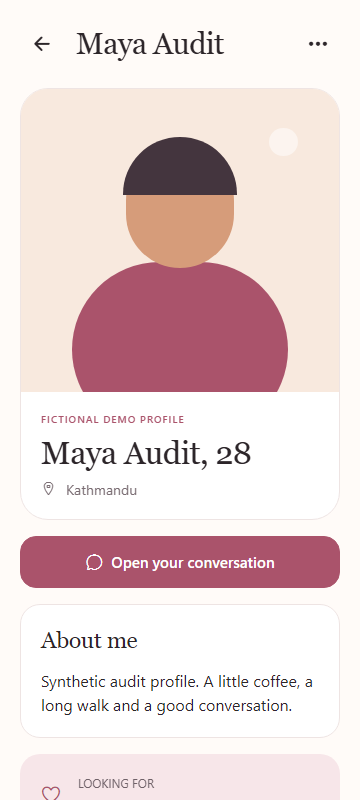 |

### 4. Choosing a game · desktop

The wide screen uses a centered dialog; each game has a distinct visual entry point, subtitle and duration. The selected match and optional readiness status are grouped separately. Invitation and acceptance rules are unchanged. The visible rose outline in this capture is the dialog’s initial keyboard focus, not an input field.

| Before                                                                          | After                                                                            |
| ------------------------------------------------------------------------------- | -------------------------------------------------------------------------------- |
| 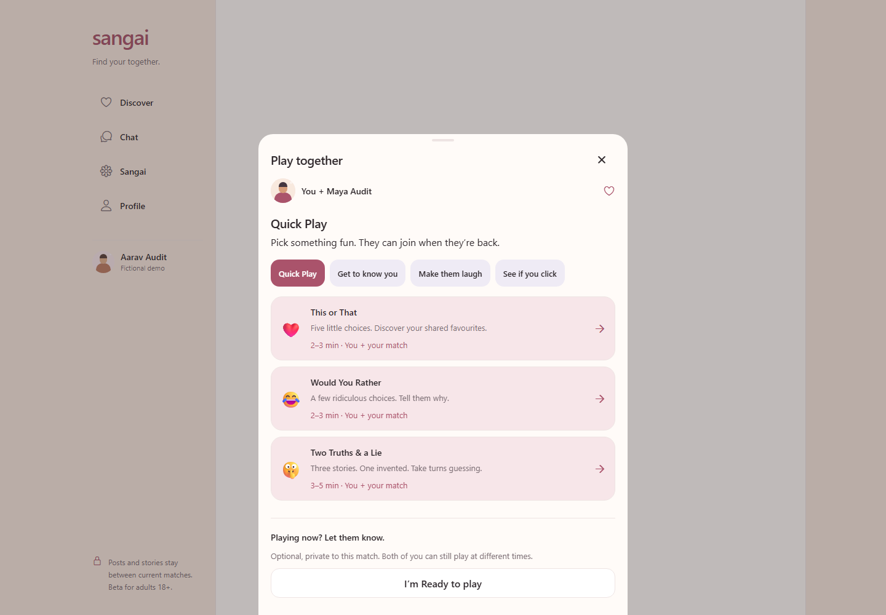 | 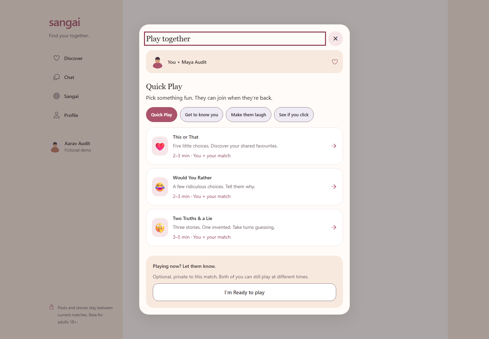 |

### 5. Creating a moment · desktop

The audience is clearly stated above the draft. Caption and media choices are grouped, the submit action belongs to the same reading column, and unsaved-draft confirmation is preserved. Upload and private-media handling are unchanged.

| Before                                                                           | After                                                                             |
| -------------------------------------------------------------------------------- | --------------------------------------------------------------------------------- |
| 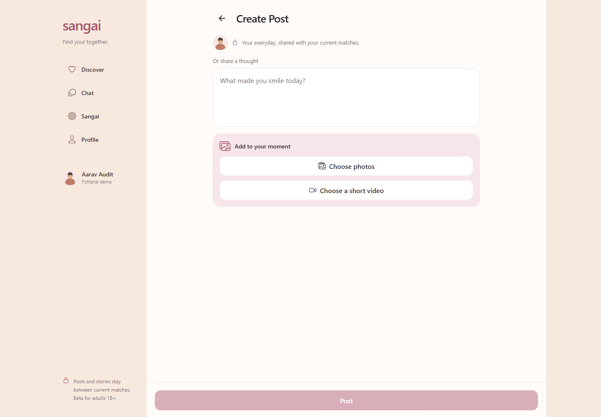 | 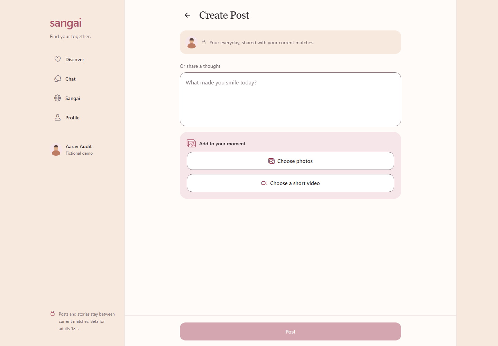 |

### 6. A game reveal · tablet

The reveal has a warm summary, separate response cards and a clear route back into conversation. Game results remain conversation starters; the UI does not present them as compatibility or safety scores.

| Before                                                                                    | After                                                                                      |
| ----------------------------------------------------------------------------------------- | ------------------------------------------------------------------------------------------ |
| 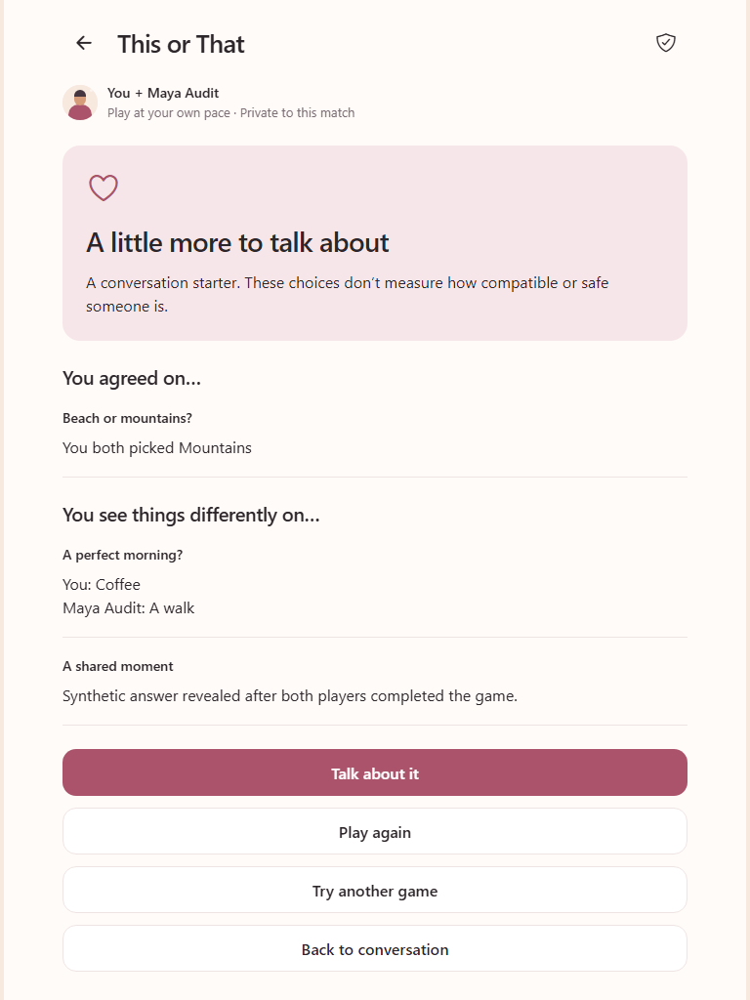 | 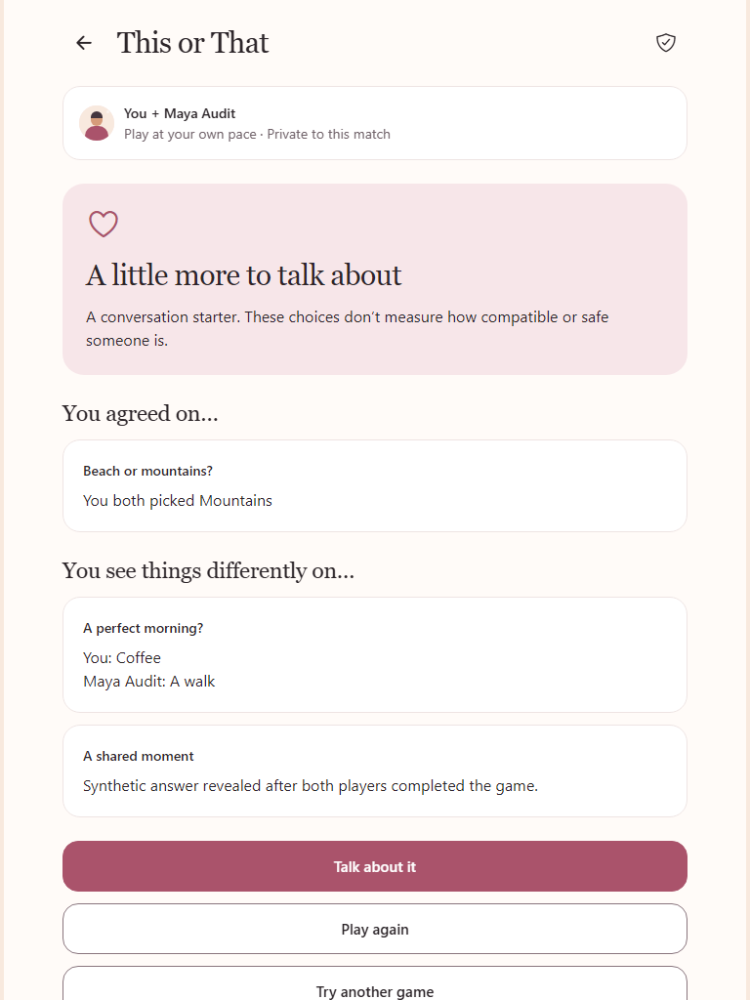 |

## Reproducing the visual audit

The reusable diagnostic suite is [reform-audit.spec.ts](../tests/ui/reform-audit.spec.ts), with [synthetic fixtures](../tests/ui/reform-audit.fixture.ts). Start the local web preview separately. In PowerShell:

```powershell
$env:SANGAI_UI_AUDIT = '1'
$env:SANGAI_AUDIT_PHASE = 'after'
$env:SANGAI_WEB_TEST_URL = 'http://127.0.0.1:8082'
Remove-Item Env:SANGAI_AUDIT_FILTER -ErrorAction SilentlyContinue
node node_modules/@playwright/test/cli.js test tests/ui/reform-audit.spec.ts --fully-parallel --workers=2 --output=artifacts/ui-reform/runner-after
```

Use `before` for the original export before changing it. `SANGAI_AUDIT_FILTER` can select a scenario by regular expression; targeted recaptures merge into that viewport’s existing manifest. A successful enabled run requires every selected scenario to render, with no unexpected API requests or browser runtime errors. The suite is skipped in ordinary test runs unless explicitly enabled. Avoid rebuilding the served export while a capture is running.

The screenshots establish frontend presentation only. See the [verification record](verification.md) for integration tests, native runtime evidence and measured performance; those are separate checks.

## Five optional follow-ups

These are ideas, not shipped behavior or backend commitments:

1. A brief shared-photo transition between a discovery card and its profile, with an immediate reduced-motion path.
2. A restrained illustration after a server-confirmed mutual match, keeping the conversation action available immediately.
3. A small tactile response when a game answer is confirmed, while preserving the existing saved, pending and retry states.
4. A compact keyboard-help sheet for desktop conversations, with shortcuts that never intercept typing or conflict with assistive technology.
5. More carefully drawn welcome illustrations derived from Sangai’s existing palette, sized locally so they add no provider dependency or font download.
